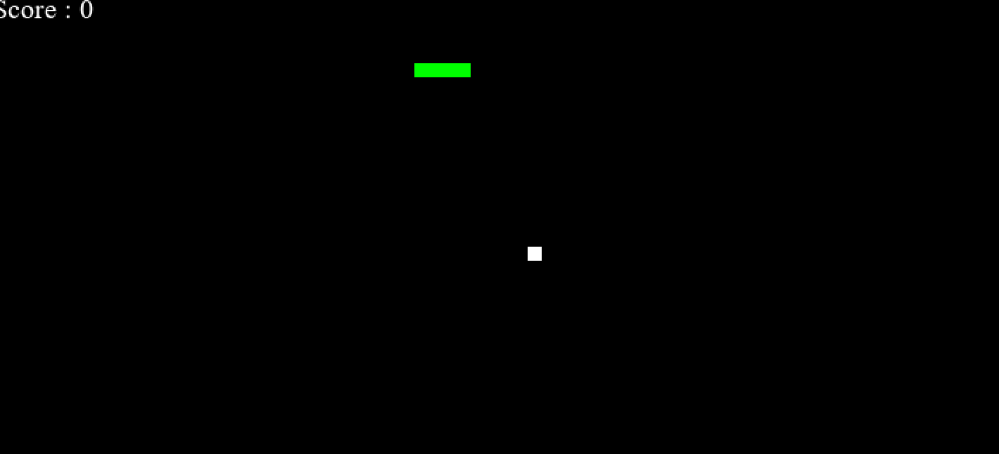

# PySnake 🐍

## Description

A fast-paced, feature-rich 2D snake game built with Python and Pygame. Control the snake using your arrow keys, collect fruit to grow longer, and survive as long as possible. The game features two distinct modes — **Normal** and **Challenge** — with progressive difficulty, a rainbow-colored snake, procedurally generated chiptune music, particle effects, and animated visuals that ramp up the intensity as your score climbs.

## Table of Contents

- [Installation](#installation)
- [Usage](#usage)
- [Credits](#credits)
- [License](#license)
- [Badges](#badges)
- [Features](#features)
- [How to Contribute](#how-to-contribute)
- [Tests](#tests)

## Installation

> ⚠️ **Requires Python 3.12 or lower.** Pygame does not yet have a pre-built wheel for Python 3.13+. If you are on a newer version, install Python 3.12 from [python.org](https://www.python.org/downloads/release/python-3128/) and use `py -3.12` in place of `python3`.

1. Clone the repository:
   ```bash
   git clone https://github.com/HassanZafar-2021/PySnake.git
   cd PySnake
   ```

2. Install the required dependency:
   ```bash
   pip install pygame
   ```

3. Launch the game:
   ```bash
   python3 snake_game.py
   ```

## Usage

Use the **arrow keys** to steer the snake. Eat the glowing fruit to grow longer and increase your score. The game speeds up as your level rises — don't let it catch you off guard.



| Key | Action |
|-----|--------|
| `↑ ↓ ← →` | Move the snake |
| `R` | Retry after game over |
| `M` | Return to main menu |
| `↑ / ↓` (menu) | Navigate mode selection |
| `Enter` | Confirm mode selection |

## Credits

Developed by [Hassan Zafar](https://github.com/HassanZafar-2021)

## License

No license — all rights reserved.

## Badges


## Features

1. **Main Menu** — Animated bouncing rainbow title with a live wandering demo snake playing in the background
2. **Normal Mode** — Classic rules: hit a wall or yourself and it's game over
3. **Challenge Mode** — Randomized obstacle blocks scattered across the map, with a 60-second countdown timer that pressures every move
4. **Rainbow Snake** — The snake's body cycles through smooth color gradients that shift as it grows
5. **Progressive Difficulty** — Speed and obstacle count increase every 50 points, keeping the game consistently challenging
6. **Particle Effects** — A burst of colored particles fires off every time the snake eats a fruit
7. **Score Pop-ups** — Floating `+10` indicators appear at the fruit's location and fade upward
8. **Pulsing Glowing Fruit** — The fruit breathes with an animated glow ring
9. **Procedural Chiptune Music** — Background music generated entirely in code using square and triangle waves; no audio files, no copyright concerns
10. **Visual HUD** — Live score, level indicator, mode tag, and (in Challenge Mode) a color-coded timer bar
11. **Game Over Screen** — Displays final score with Retry and Menu buttons; supports both mouse and keyboard input

## How to Contribute

1. Fork the repository on GitHub
2. Clone your fork locally:
   ```bash
   git clone https://github.com/your-username/PySnake.git
   ```
3. Create a new branch for your feature or fix:
   ```bash
   git checkout -b feature/your-feature-name
   ```
4. Make your changes and commit with a clear message
5. Push to your fork and open a Pull Request against the `main` branch

Please keep PRs focused — one feature or fix per request makes review much easier.

## Tests

No automated tests at this time. Manual playtesting is the current method for verifying game behavior. Contributions that add a test suite are welcome.